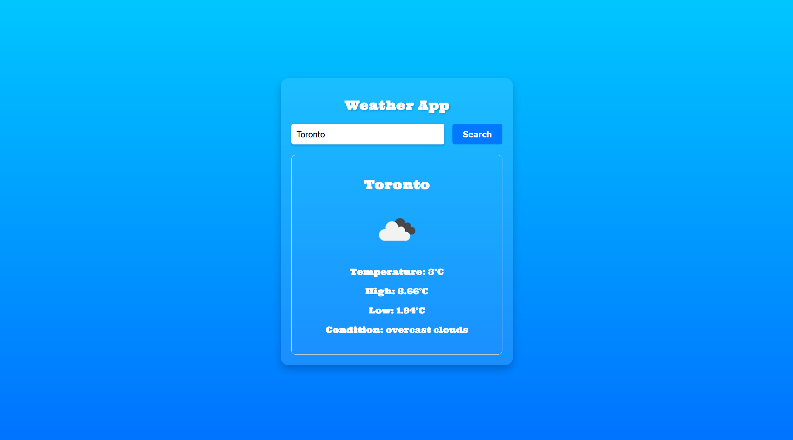

# Weather App

## Project Overview
This is a simple weather application built using **ReactJS** that allows users to check the current weather conditions for any city. The app fetches real-time weather data from the **OpenWeatherMap API** and displays important details such as temperature, weather description, and an icon representing the current weather condition.

### Key Features:
- **Real-time Weather Data:** The app fetches and displays the current weather details for a given city using the OpenWeatherMap API.
- **Search Functionality:** Users can search for any city to get the latest weather updates.
- **Weather Icons:** Displays weather icons based on the current weather condition (e.g., sunny, rainy, cloudy).
- **Responsive Design:** The app is designed to be simple and responsive.

## Demo



## Technologies Used
- **ReactJS:** JavaScript library for building user interfaces.
- **Axios:** Library for making API requests to fetch weather data.
- **OpenWeatherMap API:** Provides real-time weather data.

## Installation and Setup

### Prerequisites
- Node.js and npm (or yarn) installed on your machine.

### Steps to Run the App

1. Clone the repository:
   ```bash
   git clone https://github.com/yourusername/123456789_comp3123_labtest2.git
   cd 123456789_comp3123_labtest2
